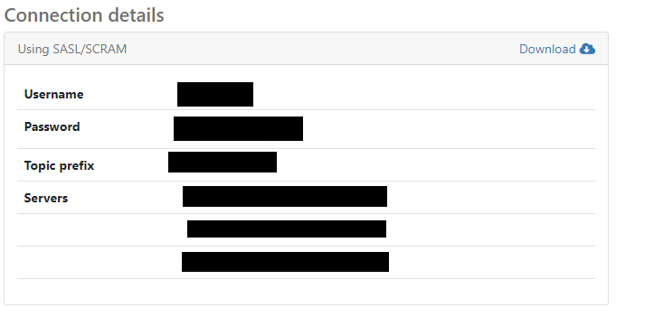
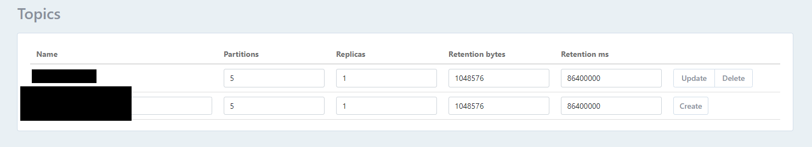

# Kotlin Example App

This is a simple guideline on the project creation and scaffolding project based on the recommended practices proposed by NestJS. The following tools will be used on this example:

- [Spring Boot](https://spring.io/projects/spring-boot) - Application Framework for Java, Kotlin & Groovy
- [OpenAPI 3](https://www.openapis.org/) - Specification and standardized documentation for REST API
- [REST API](https://restfulapi.net/) - Acronym for **RE**presentational **S**tate **T**ransfer. It is architectural style for **distributed hypermedia systems**
- [Spring Data](https://spring.io/projects/spring-data) - A familiar and consistent, Spring-based programming model for data access while still retaining the special traits of the underlying data store
- [Spring Validation](https://spring.io/guides/gs/validating-form-input/) - Takes user input and checks the input by using standard *validation* annotations
- [PostgreSQL](https://www.postgresql.org/) - A powerful, open source object-relational database system
- [MongoDB](https://www.mongodb.com/) - A general purpose, document-based, distributed database
- [Redis](https://redis.io/) - An open source (BSD licensed), in-memory data structure store, used as a database, cache, and message broker
- [GraphQL](https://graphql.org/) - A data query and manipulation language for APIs
- [gRPC](https://grpc.io/) - A modern open source high performance Remote Procedure Call (RPC) framework that can run in any environment
- [Retrofit](https://square.github.io/retrofit/) - A type-safe **HTTP client** for Android and Java
- [Apache Kafka](https://kafka.apache.org/) - Open-source distributed event streaming platform used by thousands of companies for high-performance data pipelines, streaming analytics, data integration, and mission-critical applications

## Content

- [Get Started](#Get-Started)
- [Adding Rest Controller](#Adding-Rest-Controller)
- [Adding SpringDoc OpenAPI3 Support](#Adding-SpringDoc-OpenAPI3-Support)
- [Adding Graphql Support](#Adding-Graphql-Support)
  - [Adding Graphql Federation Support](#Adding-Graphql-Federation-Support)
- [Adding Spring Data Support](#Adding-Spring-Data-Support)
- [Adding Redis Support](#Adding-Redis-Support)
- [Adding gRPC Support](#Adding-gRPC-Support)
  - [Using gRpc Common Lib](#Using-gRpc-Common-Lib)
    - [For gRpc Lib](#For-gRpc-Lib)
    - [For gRpc Server](#For-gRpc-Server)
    - [For gRpc Client](#For-gRpc-Client)
  - [Without Using Grpc Common Lib](#Without-Using-Grpc-Common-Lib)
    - [For gRpc Server](#For-gRpc-Server)
    - [For gRpc Client](#For-gRpc-Client)
- [Adding MongoDB Support](#Adding-MongoDB-Support)
- [Adding Retrofit Support](#Adding-Retrofit-Support)
- [Adding Kafka Support](#Adding-Kafka-Support)

## Get Started

Visit [Spring Initializer](https://start.spring.io/), to init the spring boot application with Kotlin.

## Adding Rest Controller

```kotlin
@RestController
@RequestMapping("/api")
class ArticleRestController(private val articleService: ArticleService) {

    @GetMapping("/articles")
    fun getAllArticles(): List<ArticleEntity> =
            articleService.findAll()
}
```


## Adding SpringDoc OpenAPI3 Support

Add the package to `build.gradle.kts` 

```yaml
implementation("org.springdoc:springdoc-openapi-ui:1.5.2")
```

Add the Spring Doc config to `application.yml`

```yaml
## Spring Doc
springdoc:
  api-docs:
    path: /api-docs
  swagger-ui:
    enabled: true
    path: /swagger-ui-custom.html
    operationsSorter: method
```

Define a configuation class `AppConfig.kt` to customize the bean of OpenApi Spec

```kotlin
@Configuration
class AppConfig {
    @Bean
    fun customOpenAPI(): OpenAPI =
        OpenAPI()
            .components(Components())
            .info(Info().title("Kotlin Example App"))
}
```

Define the Rest Controller Tag

```kotlin
@Tag(name = "ArticleRestController")
class ArticleRestController(private val articleService: ArticleService) {
	...
}
```

Visit the OpenAPI ui by

```
http://localhost:8080/swagger-ui-custom.html
```

Visit the api doc by

```
http://localhost:8080/api-docs
```


## Adding Graphql Support

Add the [package](https://netflix.github.io/dgs/) to `build.gradle.kts` 

```yaml
implementation("com.netflix.graphql.dgs:graphql-dgs-spring-boot-starter:4.9.0")
```

To use DGS Code Generation, you may need to add the codegen plugin into `build.gradle.kts` 

```kotlin
plugins {
    id("com.netflix.dgs.codegen") version "5.1.2"
}

@OptIn(kotlin.ExperimentalStdlibApi::class)
tasks.withType<com.netflix.graphql.dgs.codegen.gradle.GenerateJavaTask> {
    generateClient = true
    packageName = "com.example.netflix_dgs.generated"
}
```

Generating the code by running and the code will be generated in `build` folder

```
./gradlew generate
```

Add the basic graphql config to `application.yml`

```yaml
# Graphql
dgs:
  graphql:
    path: /graphql
    graphiql:
      enabled: true
      path: /graphiql
```

Define the graphql schema and place it into `/src/main/resources/schema` as `xxx.graphqls`

```
type Article {
    id: ID!
    title: String!
    content: String!
    authorId: String!
}

input CreateArticleDto {
    title: String!
    content: String!
    authorId: String!
}

input UpdateArticleDto {
    title: String
    content: String
    authorId: String
}

type Query {
    getAllArticles: [Article]
    getArticleById(id: Int!): Article
}

type Mutation {
    createNewArticle(createArticleDto: CreateArticleDto!) : Article!
    UpdateArticleDtoById(id: Int!, updateArticleDto: UpdateArticleDto!) : Article!
    deleteArticleById(id:Int!) : Boolean
}
```

Add the Graphql Fetcher

**Please be aware that the naming of the `@InputArgument` must be same as that in the graphql schema**  

```kotlin
@DgsComponent
class ArticleFetcher(private val articleService: ArticleService) {

    @DgsQuery
    fun getAllArticles(): List<ArticleEntity> =
        articleService.findAll()

    @DgsQuery
    fun getArticleById(@InputArgument id: Long): ArticleEntity? {
        return articleService.findById(id) ?: throw RuntimeException("Article Id does not existed")
    }

    @DgsMutation
    fun createNewArticle(@InputArgument createArticleDto: CreateArticleDto): ArticleEntity? {
        return articleService.save(createArticleDto) ?: throw RuntimeException("Author Id does not existed")
    }
}
```

**Also, the object of `@InputArgument` must be decalred as `data` with proper `@JsonProperty`** , like

```kotlin
data class CreateArticleDto(
    @JsonProperty("title")
    val title: String,
    @JsonProperty("content")
    val content: String,
    @JsonProperty("authorId")
    val authorId: String
)
```

Visit the Graphical by

```
http://localhost:8080/graphiql
```

Calling the grpahql api by

```
http://localhost:8080/graphql
```

### Adding Graphql Federation Support

You have to have at least two services

#### RDBMS Service (Article Service)

Define the new grapnel schema with declaring a field as `@key` that will be referenced by other services

Here the field `authorId` will be referenced by other service to fetch the related object

```
type Article @key(fields: "authorId"){
    id: ID!
    title: String!
    content: String!
    authorId: String!
}

input CreateArticleDto {
    title: String!
    content: String!
    authorId: String!
}

input UpdateArticleDto {
    title: String
    content: String
    authorId: String
}

type Query {
    getAllArticles: [Article]
    getArticleById(id: Int!): Article
}

type Mutation {
    createNewArticle(createArticleDto: CreateArticleDto!) : Article!
    UpdateArticleDtoById(id: Int!, updateArticleDto: UpdateArticleDto!) : Article!
    deleteArticleById(id:Int!) : Boolean
}
```

#### Mongo Service (User Service)

Define the new grapnel schema with declaring the external referenced type with `@extends` and defining its `@key` and the external field with `@external`

```
type Article @key(fields: "authorId") @extends {
    authorId: String! @external
    author: User
}

type User {
    id: ID!
    name: String!
    age: Int!
    gender: String!
}

input CreateUserDto {
    name: String!
    age: Int!
    gender: String!
}

input UpdateUserDto {
    name: String
    age: Int
    gender: String
}

type Query {
    getAllUsers: [User]
    getUserById(id: String!): User
}

type Mutation {
    createNewUser(createUserDto: CreateUserDto) : User
    updateUserById(id: String!, updateUserDto: UpdateUserDto!) : User!
    deleteUserById(id:String!) : Boolean
}
```

Defining the `@DgsEntityFetcher` and the `@DgsData`

```kotlin
@DgsComponent
class UserFetcher(private val userService: UserService) {
    @DgsEntityFetcher(name = "Article")
    fun article(values: Map<String?, Any?>): Article? {
        return (values["authorId"] as String?)?.let { Article(it, null) }
    }

    @DgsData(parentType = "Article", field = "author")
    fun authorsFetcher(dataFetchingEnvironment: DgsDataFetchingEnvironment): UserDocument? {
        val article: Article = dataFetchingEnvironment.getSource()
        return userService.findById(article.authorId).body
    }
}
```

#### Apollo Gateway

Add the package to `package.json` 

```json
{
  "name": "apollo-gateway",
  "version": "1.0.0",
  "description": "",
  "main": "index.js",
  "scripts": {
    "test": "echo \"Error: no test specified\" && exit 1",
    "start":" node index.js"
  },
  "keywords": [],
  "author": "",
  "license": "ISC",
  "dependencies": {
    "@apollo/gateway": "^0.21.4",
    "apollo-server": "^2.19.0",
    "graphql": "^15.4.0"
  }
}

```

Deine the Apollo-gateway that developed by Nodejs and defining the endpoint of graphs in `index.js`

```javascript
const { ApolloServer, gql } = require('apollo-server');
const {ApolloGateway} = require('@apollo/gateway')

const gateway = new ApolloGateway({
    serviceList: [
        { name: 'rdbms_service', url: 'http://localhost:8080/graphql' },
        { name: 'mongo_service', url: 'http://localhost:8081/graphql' },
    ]
});

const server = new ApolloServer({ gateway, subscriptions:false, tracing:true });
server.listen();
```

Visit the Graphql Playground by

```
http://localhost:4000
```

## Adding Spring Data Support

Add the package to `build.gradle.kts` 

```yaml
implementation("org.springframework.boot:spring-boot-starter-data-jpa")
implementation("org.springframework.boot:spring-boot-starter-data-jdbc")
```

Add the spring data and jpa config to `application.yml`

```yaml
## Spring DATASOURCE (DataSourceAutoConfiguration & DataSourceProperties)
spring:
  datasource:
    hikari:
      connectionTimeout: 20000
      maximumPoolSize: 5
    driver-class-name: org.postgresql.Driver
    url: jdbc:postgresql://localhost:5432/postgres
    username: postgres
    password: password
  ## Hibernate Properties
  jpa:
    generate-ddl: true
    ddl-auto: true
    show-sql: true
    properties:
      hibernate:
        format_sql: true
        dialect: org.hibernate.dialect.PostgreSQL81Dialect
```

Create a JpaRepository

```kotlin
@Repository
interface ArticleRepository : JpaRepository<ArticleEntity, Long>
```

Inject the JpaRepository to the way to use

```kotlin
@Service
class ArticleService(private val articleRepository: ArticleRepository) {
    fun findAll(): List<ArticleEntity> =
        articleRepository.findAll()
}
```

JpaRepository has the below default methods

```kotlin
articleRepository.findAll()
articleRepository.save(object)
articleRepository.findById(id)
articleRepository.delete(object)
articleRepository.deleteById(id)
...
```

## Adding Redis Support

Add the package to `build.gradle.kts` 

```yaml
    implementation("org.springframework.boot:spring-boot-starter-data-redis:2.5.5")
    implementation("redis.clients:jedis:3.7.0")
```

Add the Spring Doc config to `application.yml`

```yaml
spring:
  ## Redis
  redis:
    host: 127.0.0.1
    port: 6379
    password: password
    ttl: 3600
    tls: false
    database: 0
    pool:
      max-active: 8 # 連接池最大連接數（使用負值表示沒有限制）
      max-wait: -1 # 連接池最大阻塞等待時間（使用負值表示沒有限制）
      max-idle: 8 # 連接池中的最大空閒連接
      min-idle: 0 # 連接池中的最小空閒連接
      timeout: 0 # 連接超時時間（毫秒）
```

Add bean for Redis custom config

```kotlin
@Configuration
class AppConfig {
    @Value("\${spring.redis.host}")
    val redisHost: String = ""

    @Value("\${spring.redis.port}")
    val redisPort: Int = 0

    @Value("\${spring.redis.password}")
    val redisPassword: String = ""

    @Bean
    fun jedisConnectionFactory(): JedisConnectionFactory {
        val config: RedisStandaloneConfiguration = RedisStandaloneConfiguration(redisHost, redisPort)
        config.password = RedisPassword.of(redisPassword)
        return JedisConnectionFactory(config)
    }

    @Bean
    fun redisTemplate(): RedisTemplate<String, Any>? {
        val template = RedisTemplate<String, Any>()
        template.setConnectionFactory(jedisConnectionFactory())
        return template
    }
}
```

Define a `RedisUtil`

```kotlin
@Component
class RedisUtil {

    @Resource
    private lateinit var redisTemplate: RedisTemplate<String, Any>

    // =============================common============================
    /**
     * 指定緩存失效時間
     * @param key 鍵
     * @param time 時間(秒)
     * @return
     */
    fun expire(key: String, time: Long): Boolean {
        try {
            if (time > 0) {
                redisTemplate.expire(key, time, TimeUnit.SECONDS)
            }
            return true
        } catch (e: Exception) {
            e.printStackTrace()
            return false
        }

    }

    /**
     * 根據key 獲取過期時間
     * @param key 鍵 不能為null
     * @return 時間(秒) 返回0代表為永久有效
     */
    fun getExpire(key: String): Long {
        return redisTemplate.getExpire(key, TimeUnit.SECONDS)
    }

    /**
     * 判斷key是否存在
     * @param key 鍵
     * @return true 存在 false不存在
     */
    fun hasKey(key: String): Boolean {
        try {
            return redisTemplate.hasKey(key)
        } catch (e: Exception) {
            e.printStackTrace()
            return false
        }

    }

    /**
     * 刪除緩存
     * @param key 可以傳一個值 或多個
     */
    fun del(vararg key: String) {
        if (key.isNotEmpty()) {
            if (key.size == 1) {
                redisTemplate.delete(key[0])
            } else {
                redisTemplate.delete(key.toList())
            }
        }
    }

    // ============================String=============================
    /**
     * 普通緩存獲取
     * @param key 鍵
     * @return 值
     */
    operator fun get(key: String?): Any? {
        return if (key == null) null else redisTemplate.opsForValue().get(key)
    }

    /**
     * 普通緩存放入
     * @param key 鍵
     * @param value 值
     * @return true成功 false失敗
     */
    operator fun set(key: String, value: Any): Boolean {
        try {
            redisTemplate.opsForValue().set(key, value)
            return true
        } catch (e: Exception) {
            e.printStackTrace()
            return false
        }

    }

    /**
     * 普通緩存放入並設置時間
     * @param key 鍵
     * @param value 值
     * @param time 時間(秒) time要大於0 如果time小於等於0 將設置無限期
     * @return true成功 false 失敗
     */
    operator fun set(key: String, value: Any, time: Long): Boolean {
        try {
            if (time > 0) {
                redisTemplate.opsForValue().set(key, value, time, TimeUnit.SECONDS)
            } else {
                set(key, value)
            }
            return true
        } catch (e: Exception) {
            e.printStackTrace()
            return false
        }

    }

    /**
     * 遞增
     * @param key 鍵
     * @param delta 要增加幾(大於0)
     * @return
     */
    fun incr(key: String, delta: Long): Long {
        if (delta < 0) {
            throw RuntimeException("遞增因子必須大於0")
        }
        return redisTemplate.opsForValue().increment(key, delta)!!
    }

    /**
     * 遞減
     * @param key 鍵
     * @param delta 要減少幾(小於0)
     * @return
     */
    fun decr(key: String, delta: Long): Long {
        if (delta < 0) {
            throw RuntimeException("遞減因子必須大於0")
        }
        return redisTemplate.opsForValue().increment(key, -delta)!!
    }

    // ================================Map=================================
    /**
     * HashGet
     * @param key 鍵 不能為null
     * @param item 項 不能為null
     * @return 值
     */
    fun hget(key: String, item: String): Any? {
        return redisTemplate.opsForHash<Any, Any>().get(key, item)
    }

    /**
     * 獲取hashKey對應的所有鍵值
     * @param key 鍵
     * @return 對應的多個鍵值
     */
    fun hmget(key: String): Map<Any, Any> {
        return redisTemplate.opsForHash<Any, Any>().entries(key)
    }

    /**
     * HashSet
     * @param key 鍵
     * @param map 對應多個鍵值
     * @return true 成功 false 失敗
     */
    fun hmset(key: String, map: Map<String, Any>): Boolean {
        try {
            redisTemplate.opsForHash<Any, Any>().putAll(key, map)
            return true
        } catch (e: Exception) {
            e.printStackTrace()
            return false
        }

    }

    /**
     * HashSet 並設置時間
     * @param key 鍵
     * @param map 對應多個鍵值
     * @param time 時間(秒)
     * @return true成功 false失敗
     */
    fun hmset(key: String, map: Map<String, Any>, time: Long): Boolean {
        try {
            redisTemplate.opsForHash<Any, Any>().putAll(key, map)
            if (time > 0) {
                expire(key, time)
            }
            return true
        } catch (e: Exception) {
            e.printStackTrace()
            return false
        }

    }

    /**
     * 向一張hash表中放入數據,如果不存在將創建
     * @param key 鍵
     * @param item 項
     * @param value 值
     * @return true 成功 false失敗
     */
    fun hset(key: String, item: String, value: Any): Boolean {
        try {
            redisTemplate.opsForHash<Any, Any>().put(key, item, value)
            return true
        } catch (e: Exception) {
            e.printStackTrace()
            return false
        }

    }

    /**
     * 向一張hash表中放入數據,如果不存在將創建
     * @param key 鍵
     * @param item 項
     * @param value 值
     * @param time 時間(秒) 注意:如果已存在的hash表有時間,這裡將會替換原有的時間
     * @return true 成功 false失敗
     */
    fun hset(key: String, item: String, value: Any, time: Long): Boolean {
        try {
            redisTemplate.opsForHash<Any, Any>().put(key, item, value)
            if (time > 0) {
                expire(key, time)
            }
            return true
        } catch (e: Exception) {
            e.printStackTrace()
            return false
        }

    }

    /**
     * 刪除hash表中的值
     * @param key 鍵 不能為null
     * @param item 項 可以使多個 不能為null
     */
    fun hdel(key: String, vararg item: Any) {
        redisTemplate.opsForHash<Any, Any>().delete(key, *item)
    }

    /**
     * 判斷hash表中是否有該項的值
     * @param key 鍵 不能為null
     * @param item 項 不能為null
     * @return true 存在 false不存在
     */
    fun hHasKey(key: String, item: String): Boolean {
        return redisTemplate.opsForHash<Any, Any>().hasKey(key, item)
    }

    /**
     * hash遞增 如果不存在,就會創建一個 並把新增後的值返回
     * @param key 鍵
     * @param item 項
     * @param by 要增加幾(大於0)
     * @return
     */
    fun hincr(key: String, item: String, by: Double): Double {
        return redisTemplate.opsForHash<Any, Any>().increment(key, item, by)
    }

    /**
     * hash遞減
     * @param key 鍵
     * @param item 項
     * @param by 要減少記(小於0)
     * @return
     */
    fun hdecr(key: String, item: String, by: Double): Double {
        return redisTemplate.opsForHash<Any, Any>().increment(key, item, -by)
    }

    // ============================set=============================
    /**
     * 根據key獲取Set中的所有值
     * @param key 鍵
     * @return
     */
    fun sGet(key: String): Set<Any>? {
        try {
            return redisTemplate.opsForSet().members(key)
        } catch (e: Exception) {
            e.printStackTrace()
            return null
        }

    }

    /**
     * 根據value從一個set中查詢,是否存在
     * @param key 鍵
     * @param value 值
     * @return true 存在 false不存在
     */
    fun sHasKey(key: String, value: Any): Boolean {
        try {
            return redisTemplate.opsForSet().isMember(key, value)!!
        } catch (e: Exception) {
            e.printStackTrace()
            return false
        }

    }

    /**
     * 將數據放入set緩存
     * @param key 鍵
     * @param values 值 可以是多個
     * @return 成功個數
     */
    fun sSet(key: String, vararg values: Any): Long {
        try {
            return redisTemplate.opsForSet().add(key, *values)!!
        } catch (e: Exception) {
            e.printStackTrace()
            return 0
        }

    }

    /**
     * 將set數據放入緩存
     * @param key 鍵
     * @param time 時間(秒)
     * @param values 值 可以是多個
     * @return 成功個數
     */
    fun sSetAndTime(key: String, time: Long, vararg values: Any): Long {
        try {
            val count = redisTemplate.opsForSet().add(key, *values)
            if (time > 0)
                expire(key, time)
            return count!!
        } catch (e: Exception) {
            e.printStackTrace()
            return 0
        }

    }

    /**
     * 獲取set緩存的長度
     * @param key 鍵
     * @return
     */
    fun sGetSetSize(key: String): Long {
        try {
            return redisTemplate.opsForSet().size(key)!!
        } catch (e: Exception) {
            e.printStackTrace()
            return 0
        }

    }

    /**
     * 移除值為value的
     * @param key 鍵
     * @param values 值 可以是多個
     * @return 移除的個數
     */
    fun setRemove(key: String, vararg values: Any): Long {
        try {
            val count = redisTemplate.opsForSet().remove(key, *values)
            return count!!
        } catch (e: Exception) {
            e.printStackTrace()
            return 0
        }

    }
    // ===============================list=================================

    /**
     * 獲取list緩存的內容
     * @param key 鍵
     * @param start 開始
     * @param end 結束 0 到 -1代表所有值
     * @return
     */
    fun lGet(key: String, start: Long, end: Long): List<Any>? {
        try {
            return redisTemplate.opsForList().range(key, start, end)
        } catch (e: Exception) {
            e.printStackTrace()
            return null
        }

    }

    /**
     * 獲取list緩存的長度
     * @param key 鍵
     * @return
     */
    fun lGetListSize(key: String): Long {
        try {
            return redisTemplate.opsForList().size(key)!!
        } catch (e: Exception) {
            e.printStackTrace()
            return 0
        }

    }

    /**
     * 通過索引 獲取list中的值
     * @param key 鍵
     * @param index 索引 index>=0時， 0 表頭，1 第二個元素，依次類推；index<0時，-1，表尾，-2倒數第二個元素，依次類推
     * @return
     */
    fun lGetIndex(key: String, index: Long): Any? {
        try {
            return redisTemplate.opsForList().index(key, index)
        } catch (e: Exception) {
            e.printStackTrace()
            return null
        }

    }

    /**
     * 將list放入緩存
     * @param key 鍵
     * @param value 值
     * @param time 時間(秒)
     * @return
     */
    fun lSet(key: String, value: Any): Boolean {
        try {
            redisTemplate.opsForList().rightPush(key, value)
            return true
        } catch (e: Exception) {
            e.printStackTrace()
            return false
        }

    }

    /**
     * 將list放入緩存
     * @param key 鍵
     * @param value 值
     * @param time 時間(秒)
     * @return
     */
    fun lSet(key: String, value: Any, time: Long): Boolean {
        try {
            redisTemplate.opsForList().rightPush(key, value)
            if (time > 0)
                expire(key, time)
            return true
        } catch (e: Exception) {
            e.printStackTrace()
            return false
        }

    }

    /**
     * 將list放入緩存
     * @param key 鍵
     * @param value 值
     * @param time 時間(秒)
     * @return
     */
    fun lSet(key: String, value: List<Any>): Boolean {
        try {
            redisTemplate.opsForList().rightPushAll(key, *value.toTypedArray())
            return true
        } catch (e: Exception) {
            e.printStackTrace()
            return false
        }

    }

    /**
     * 將list放入緩存
     *
     * @param key 鍵
     * @param value 值
     * @param time 時間(秒)
     * @return
     */
    fun lSet(key: String, value: List<Any>, time: Long): Boolean {
        try {
            redisTemplate.opsForList().rightPushAll(key, *value.toTypedArray())
            if (time > 0)
                expire(key, time)
            return true
        } catch (e: Exception) {
            e.printStackTrace()
            return false
        }

    }

    /**
     * 根據索引修改list中的某條數據
     * @param key 鍵
     * @param index 索引
     * @param value 值
     * @return
     */
    fun lUpdateIndex(key: String, index: Long, value: Any): Boolean {
        try {
            redisTemplate.opsForList().set(key, index, value)
            return true
        } catch (e: Exception) {
            e.printStackTrace()
            return false
        }

    }

    /**
     * 移除N個值為value
     * @param key 鍵
     * @param count 移除多少個
     * @param value 值
     * @return 移除的個數
     */
    fun lRemove(key: String, count: Long, value: Any): Long {
        try {
            val remove = redisTemplate.opsForList().remove(key, count, value)
            return remove!!
        } catch (e: Exception) {
            e.printStackTrace()
            return 0
        }

    }
}
```

Use the RedisUtil

```kotlin
@Service
class ArticleService(private val articleRepository: ArticleRepository) {
    val key = "article"
    val mapper = jacksonObjectMapper()

    @Value("\${spring.redis.ttl}")
    val ttl: Long = 0;

    @Resource
    private lateinit var redisUtil: RedisUtil

    fun findAll(): List<ArticleEntity> =
        articleRepository.findAll()


    fun save(@Valid createArticleDto: CreateArticleDto): ArticleEntity {
        val articleEntity: ArticleEntity = mapper.convertValue<ArticleEntity>(createArticleDto)
        val result = articleRepository.save(articleEntity)
        Thread {
            redisUtil.hset(key, articleEntity.id.toString(), mapper.writeValueAsString(result), ttl)
        }.start()
        return result
    }


    fun findById(articleId: Long): ResponseEntity<ArticleEntity> {
        var redisResult = redisUtil.hget(key, articleId.toString())
        if (redisResult != null) {
            val result = mapper.readValue(redisResult.toString(), ArticleEntity::class.java)
            return ResponseEntity.ok(result)
        } else
            return articleRepository.findById(articleId).map { result ->
                redisUtil.hset(key, articleId.toString(), mapper.writeValueAsString(result), ttl)
                ResponseEntity.ok(result)
            }.orElse(ResponseEntity.notFound().build())
    }

    fun update(
        articleId: Long,
        @Valid updateArticleDto: UpdateArticleDto
    ): ResponseEntity<ArticleEntity> {
        redisUtil.hdel(key, articleId.toString())
        return articleRepository.findById(articleId).map { existingArticle ->
            val updatedArticle: ArticleEntity = existingArticle
                .copy(
                    title = if (updateArticleDto?.title != null) updateArticleDto.title else existingArticle.title,
                    content = if (updateArticleDto?.content != null) updateArticleDto.content else existingArticle.content
                )

            ResponseEntity.ok().body(articleRepository.save(updatedArticle))
        }.orElse(ResponseEntity.notFound().build())
    }

    fun delete(articleId: Long): ResponseEntity<Void> {
        redisUtil.hdel(key, articleId.toString())
        return articleRepository.findById(articleId).map { article ->
            articleRepository.delete(article)
            ResponseEntity<Void>(HttpStatus.OK)
        }.orElse(ResponseEntity.notFound().build())
    }
}
```


## Adding gRPC Support

### Using gRpc Common Lib

#### For gRpc Lib

Add the required plugin and dependencies to `build.gradle.kts` 

```kotlin
import org.jetbrains.kotlin.gradle.tasks.KotlinCompile
import com.google.protobuf.gradle.*;

buildscript {
	dependencies {
		classpath("com.google.protobuf:protobuf-gradle-plugin:0.8.13")
	}
}

plugins {
	id("com.google.protobuf") version "0.8.13"
//	kotlin("jvm") version "1.4.32" // remove the version tag if you are build by other project
	kotlin("jvm")
}

group = "com.kotlingrpc"
version = "0.0.1-SNAPSHOT"
java.sourceCompatibility = JavaVersion.VERSION_11

allprojects {
	repositories {
		mavenLocal()
		mavenCentral()
		google()
	}
}


dependencies {
	implementation("org.jetbrains.kotlin:kotlin-reflect")
	compileOnly("javax.annotation:javax.annotation-api:1.3.2")
	implementation("org.jetbrains.kotlinx:kotlinx-coroutines-core:1.3.9")
	implementation("org.jetbrains.kotlin:kotlin-stdlib-jdk8")
	// gRPC
	api("io.grpc:grpc-kotlin-stub:0.2.1")
	implementation("io.grpc:protoc-gen-grpc-kotlin:1.1.0")
}

tasks.withType<KotlinCompile> {
	kotlinOptions {
		freeCompilerArgs = listOf("-Xjsr305=strict")
		jvmTarget = "11"
	}
}

protobuf {
	protoc{
		artifact = "com.google.protobuf:protoc:3.14.0:osx-x86_64" // you need to mention :osx-x86_64 behind if you are using m1 mac
	}
	generatedFilesBaseDir = "$projectDir/src/main/kotlin/generated"
	plugins {
		id("grpc"){
			artifact = "io.grpc:protoc-gen-grpc-java:1.36.0:osx-x86_64" // you need to mention :osx-x86_64 behind if you are using m1 mac
		}
		id("grpckt") {
			artifact = "io.grpc:protoc-gen-grpc-kotlin:1.1.0:jdk7@jar"
		}
	}
	generateProtoTasks {
		ofSourceSet("main").forEach { generateProtoTask ->
			generateProtoTask
				.plugins {
					id("grpc")
					id("grpckt")
				}
		}
	}
}
```

Create a proto in `src/main/proto`

```proto
syntax = "proto3";

import "google/protobuf/empty.proto";

option java_multiple_files = true;

package com.example.kotlin_example_app;

service ArticleService {
  rpc FindAllArticles (google.protobuf.Empty) returns (ArticleList);
}

message ArticleList {
  repeated Article articles = 1;
}

message Article {
  int64 id = 1;
  string title = 2;
  string content = 3;
  string authorId = 4;
}
```

Generate the `stub` and `message` based on the proto file by

```
./gradlew generateProto
```

#### For Grpc Server

Add the required plugin and dependencies to `build.gradle.kts` 

```kotlin
dependencies {
    // gRPC
    implementation(project(":grpc_lib"))
    implementation("net.devh:grpc-spring-boot-starter:2.12.0.RELEASE")
}
```

Add grpc config to `application.yml`

```yaml
grpc:
  server:
    port: 9090
```

Add a GrpcService

```kotlin
@GrpcService
class ArticleGrpcService(private val articleService: ArticleService) : ArticleServiceGrpcKt.ArticleServiceCoroutineImplBase() {
    override suspend fun findAllArticles(request: Empty): ArticleList {
        var articles: List<ArticleEntity> =  articleService.findAll()

        var articleList : ArrayList<Article> = ArrayList<Article>()
        for (article: ArticleEntity in articles) {
            var article : Article = Article.newBuilder()
                .setId(article.id)
                .setTitle(article.title)
                .setContent(article.content)
                .setAuthorId(article.authorId)
                .build()
            articleList.add(article)
        }
        return ArticleList.newBuilder().addAllArticles(articleList).build()
    }
}
```

#### For Grpc Client

Add the required plugin and dependencies to `build.gradle.kts` 

```kotlin
dependencies {
    // gRPC
    implementation(project(":grpc_lib"))
    implementation("net.devh:grpc-spring-boot-starter:2.12.0.RELEASE")
    implementation("org.jetbrains.kotlinx:kotlinx-coroutines-core:1.5.2")
}
```

Add grpc config to `application.yml`

```yaml
grpc:
  client:
    articleGrpcServer:
      address: static://127.0.0.1:9090
      enableKeepAlive: true
      keepAliveWithoutCalls: true
      negotiationType: plaintext
```

Define an External Service that connect to other gRPC server

```kotlin
@Service
class ExternalService {
    @GrpcClient("articleGrpcServer") // same name as that in application.yml
    private val articleServiceStub: ArticleServiceGrpcKt.ArticleServiceCoroutineStub? = null

    fun getAllArticlesCount(): Int {
        var result : ArticleList = ArticleList.newBuilder().build()
        runBlocking {
            launch {
                result = articleServiceStub?.findAllArticles(Empty.newBuilder().build()) ?: ArticleList.newBuilder().build()
            }
        }
        return result.articlesCount
    }
}
```

### Without Using gRPC Common Lib
Add the required plugin and dependencies to `build.gradle.kts` 

```yaml
import com.google.protobuf.gradle.*

plugins {
    id("com.google.protobuf") version "0.8.13"
}

dependencies {
    api("io.grpc:grpc-kotlin-stub:0.2.1")
    implementation("net.devh:grpc-spring-boot-starter:2.12.0.RELEASE")
}

protobuf {
    protoc {
        artifact = "com.google.protobuf:protoc:3.10.0:osx-x86_64" // you need to mention :osx-x86_64 behind if you are using m1 mac
    }

    plugins {
        id("grpc") {
            artifact = "io.grpc:protoc-gen-grpc-java:1.25.0:osx-x86_64" // you need to mention :osx-x86_64 behind if you are using m1 mac
        }
        id("grpckt") {
            artifact = "io.grpc:protoc-gen-grpc-kotlin:1.1.0:jdk7@jar"
        }
    }

    generateProtoTasks {
        ofSourceSet("main").forEach { generateProtoTask ->
            generateProtoTask
                .plugins {
                    id("grpc")
                    id("grpckt")
                }
        }
    }
}
```

Create a proto in `src/main/proto`

```proto
syntax = "proto3";

import "google/protobuf/empty.proto";

option java_multiple_files = true;

package com.example.kotlin_example_app;

service ArticleService {
  rpc FindAllArticles (google.protobuf.Empty) returns (ArticleList);
}

message ArticleList {
  repeated Article articles = 1;
}

message Article {
  int64 id = 1;
  string title = 2;
  string content = 3;
  string authorId = 4;
}
```

Generate the `stub` and `message` based on the proto file by

```
./gradlew generateProto
```

### For Grpc Server

Add grpc config to `application.yml`

```yaml
grpc:
  server:
    port: 9090
```

Add a GrpcService

```kotlin
@GrpcService
class ArticleGrpcService(private val articleService: ArticleService) : ArticleServiceGrpcKt.ArticleServiceCoroutineImplBase() {
    override suspend fun findAllArticles(request: Empty): ArticleList {
        var articles: List<ArticleEntity> =  articleService.findAll()

        var articleList : ArrayList<Article> = ArrayList<Article>()
        for (article: ArticleEntity in articles) {
            var article : Article = Article.newBuilder()
                .setId(article.id)
                .setTitle(article.title)
                .setContent(article.content)
                .setAuthorId(article.authorId)
                .build()
            articleList.add(article)
        }
        return ArticleList.newBuilder().addAllArticles(articleList).build()
    }
}
```

### For Grpc Client

Add grpc config to `application.yml`

```yaml
grpc:
  client:
    articleGrpcServer:
      address: static://127.0.0.1:9090
      enableKeepAlive: true
      keepAliveWithoutCalls: true
      negotiationType: plaintext
```

Define an External Service that connect to other gRPC server

```kotlin
@Service
class ExternalService {
    @GrpcClient("articleGrpcServer") // same name as that in aqpplication.yml
    private val articleServiceStub: ArticleServiceGrpcKt.ArticleServiceCoroutineStub? = null

    fun getAllArticlesCount(): Int {
        var result : ArticleList = ArticleList.newBuilder().build()
        runBlocking {
            launch {
                result = articleServiceStub?.findAllArticles(Empty.newBuilder().build()) ?: ArticleList.newBuilder().build()
            }
        }
        return result.articlesCount
    }
}
```

## Adding MongoDB Support

Add the package to `build.gradle.kts` 

```yaml
implementation("org.springframework.boot:spring-boot-starter-data-mongodb:2.5.5")
```

Add the mongodb config to `application.yml`

```yaml
spring:
  data:
    ## Mongodb
    mongodb:
      authentication-database: admin
      username: root
      password: example
      database: test_db
      host: localhost
      port: 27017
```

Create a Mongo Document

```kotlin
@Document(collection = "customers")
data class UserDocument(
    @Id
    val id: String = "",

    @Field("name")
    val name: String = "",

    @Field("age")
    val age: Int? = null,

    @Field("gender")
    val gender: String? = null
)
```

Create the Mongo Repository

```kotlin
interface UserRepository : MongoRepository<UserDocument, String> {}
```

## Adding Retrofit Support

Add the package to `build.gradle.kts` 

```yaml
    implementation("com.squareup.retrofit2:retrofit:2.9.0")
    implementation("com.squareup.retrofit2:converter-jackson:2.9.0")
    implementation("com.squareup.okhttp3:logging-interceptor:4.9.1")
    implementation("com.squareup.okhttp3:okhttp:4.9.1")
```

Define the external services config to `application.yml`

```yaml
external-services:
  mongo-service:
    endpoint: http://localhost:8081
```

Create the Retrofit config

```kotlin
@Configuration
class RetrofitConfig {
    @Autowired
    var environment: Environment? = null

    @Bean("mongoServiceRetrofit")
    fun createMongoServiceRetrofit(): Retrofit? {
        return Retrofit.Builder()
            .baseUrl(environment!!.getProperty("external-services.mongo-service.endpoint")!!)
            .addConverterFactory(JacksonConverterFactory.create())
            .client(okhttpclient()!!)
            .build()
    }

    fun okhttpclient(): OkHttpClient? {
        val logInterceptor = HttpLoggingInterceptor(HttpLoggingInterceptor.Logger.DEFAULT)
        logInterceptor.setLevel(HttpLoggingInterceptor.Level.BODY)
        return OkHttpClient.Builder()
            .connectTimeout(15, TimeUnit.SECONDS)
            .addNetworkInterceptor(logInterceptor)
            .build()
    }
}
```

Create the REST api interface

```kotlin
interface MongoServiceRestApi {
    @GET("/api/users/{id}")
    fun findUserById(
        @Path("id") id: String
    ): Call<Any>
}
```

Autowire the retrofit on the place to use and call the api in the function

```kotlin
@Service
class MongoService {
    @Autowired
    @Qualifier("mongoServiceRetrofit")
    lateinit var mongoServiceRetrofit: Retrofit

    fun findById(id: String): Any? {
        val mongoServiceRestApi: MongoServiceRestApi = mongoServiceRetrofit.create(MongoServiceRestApi::class.java)
        val response = mongoServiceRestApi.findUserById(id).execute()
        return response.body()
    }
}
```

## Adding Kafka Support

### Preparation

1. Reach [CloudKarafka](https://www.cloudkarafka.com/) to create a Kafka Cloud Server

2. Remember the connection details and the topic

   



### Setup

Add the package to `build.gradle.kts` 

```yaml
implementation("org.springframework.kafka:spring-kafka:2.7.7")
```

### Producer

Define the Kafka config to `application.yml` for producer

```yaml
spring:
  ## kafka
  kafka:
    bootstrap-servers: ${CLOUDKARAFKA_BROKERS:velomobile-01.srvs.cloudkafka.com:9094,velomobile-02.srvs.cloudkafka.com:9094,velomobile-03.srvs.cloudkafka.com:9094}
    template:
      default-topic: ${CLOUDKARAFKA_USERNAME}-topic
    producer:
      key-serializer: org.apache.kafka.common.serialization.StringSerializer
      value-serializer: org.apache.kafka.common.serialization.StringSerializer
      acks: 1
      retries: 0
      batch-size: 16384
      buffer-memory: 33554432
    properties:
      security:
        protocol: SASL_SSL
      sasl:
        mechanism: SCRAM-SHA-256
        jaas:
          config: 'org.apache.kafka.common.security.scram.ScramLoginModule required username="${KAFKA_USERNAME}" password="${KAFKA_PASSWORD}";'
```

Define a Kafka rest controller

```kotlin
@Tag(name = "KafkaRestController")
@RestController
@RequestMapping("/api")
class KafkaRestController(private val kafkaService: KafkaService) {
    @GetMapping("kafka/send/{input}")
    fun sendMessage(@PathVariable input: String?) {
        return kafkaService.sendMessage(input)
    }
}
```

Define a Kafka service to use Kafka template

```kotlin
@Service
class KafkaService(val kafkaTemplate: KafkaTemplate<String, String>) {
    fun sendMessage(@PathVariable input: String?) {
        try {
            kafkaTemplate.send("${CLOUDKARAFKA_USERNAME}-topic", input)
        } catch (e: Exception) {
            e.printStackTrace()
        }
    }
}
```

### Consumer

Define the Kafka config to `application.yml` for producer

```yaml
spring:
  ## kafka
  kafka:
    bootstrap-servers: ${CLOUDKARAFKA_BROKERS:velomobile-01.srvs.cloudkafka.com:9094,velomobile-02.srvs.cloudkafka.com:9094,velomobile-03.srvs.cloudkafka.com:9094}
    template:
      default-topic: ${CLOUDKARAFKA_USERNAME}-topic
    consumer:
      group-id: ${CLOUDKARAFKA_USERNAME}-consumers
      enable-auto-commit: true
      auto-commit-interval: 1000
      auto-offset-reset: earliest
      max-poll-records: 500
      key-deserializer: org.apache.kafka.common.serialization.StringDeserializer
      value-deserializer: org.apache.kafka.common.serialization.StringDeserializer
    lisener:
      ack-mode: manual_immediate
      poll-timeout: 500S
    properties:
      security:
        protocol: SASL_SSL
      sasl:
        mechanism: SCRAM-SHA-256
        jaas:
          config: 'org.apache.kafka.common.security.scram.ScramLoginModule required username="${KAFKA_USERNAME}" password="${KAFKA_PASSWORD}";'
```

Define a Kafka consumer

```kotlin
@Component
class KafkaConsumer {
    @KafkaListener(topics = ["${CLOUDKARAFKA_USERNAME}-topic"])
    fun receive(payload: String) {
        LOGGER.info("Received payload='$payload'")
    }

    companion object {
        private val LOGGER = LoggerFactory.getLogger(KafkaConsumer::class.java)
    }
}
```

